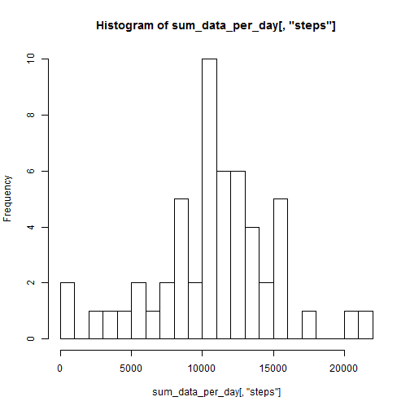
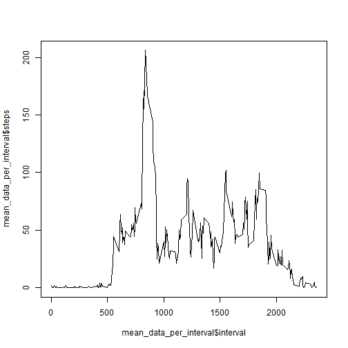
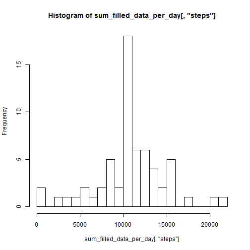
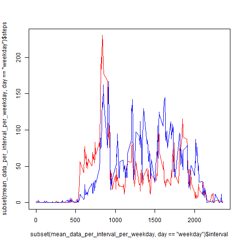

## Loading and preprocessing the data

```r
data = read.csv("activity.csv")
```

## What is mean total number of steps taken per day?

```r
sum_data_per_day = aggregate(steps ~ date, data=data, sum, na.action=na.omit)
summary(sum_data_per_day)
```

```
##          date        steps      
##  2012-10-02: 1   Min.   :   41  
##  2012-10-03: 1   1st Qu.: 8841  
##  2012-10-04: 1   Median :10765  
##  2012-10-05: 1   Mean   :10766  
##  2012-10-06: 1   3rd Qu.:13294  
##  2012-10-07: 1   Max.   :21194  
##  (Other)   :47
```

```r
hist(sum_data_per_day[,"steps"], breaks=20)
```

 

As can be seen by the result above the average steps/day is 10766.
The median is 10765.


## What is the average daily activity pattern?

```r
mean_data_per_interval = aggregate(steps ~ interval, data=data, mean, na.action=na.omit)
plot(mean_data_per_interval$interval, mean_data_per_interval$steps, type = "l")
```

 


```r
mean_data_per_interval[which.max( mean_data_per_interval[,"steps"] ),"interval"]
```

```
## [1] 835
```

The 5-minute interval, on average across all the days in the dataset, that contains the maximum number of steps is the 835.


## Imputing missing values

The total number of missing values in the dataset (i.e. the total number of steps with NAs) is 2304:


```r
sum(is.na(data$steps))
```

```
## [1] 2304
```

```r
sum(is.na(data$date))
```

```
## [1] 0
```

```r
sum(is.na(data$interval))
```

```
## [1] 0
```

Let's fill NAs with global 5min interval mean, adjusting to the day's mean (if not NA):


```r
typical_day_steps = mean(sum_data_per_day$steps)
sum_data_per_day_w_NA = aggregate(steps ~ date, data=data, sum, na.action=na.pass)
# Calculate relative values
sum_data_relative_per_day_w_NA = sum_data_per_day_w_NA$steps/typical_day_steps
# NAs are considered as mean relative value (1)
sum_data_relative_per_day_w_NA[which(is.na(sum_data_relative_per_day_w_NA), arr.ind=TRUE)] = 1
sum_data_relative_per_day_w_NA = rep(sum_data_relative_per_day_w_NA, each=288)

# data matrix with typical values for intervals
mean_data_per_interval_per_day = data.frame(interval=rep(mean_data_per_interval$interval, times = length(unique(data$date))), steps= rep(mean_data_per_interval$steps, times = length(unique(data$date))))
# correct data matrix for day mean relative to typical day (mean)
mean_data_per_interval_per_day$steps = mean_data_per_interval_per_day$steps * sum_data_relative_per_day_w_NA

data_na_rows = which(is.na(data), arr.ind=TRUE)[,1]

filled_data = data
filled_data[data_na_rows, "steps"] = mean_data_per_interval_per_day[ data_na_rows, "steps"]

# Verify if all is filled
sum(is.na(filled_data$steps))
```

```
## [1] 0
```

Histogram of the total number of steps taken each day (now with filled NAs data): 


```r
sum_filled_data_per_day = aggregate(steps ~ date, data=filled_data, sum, na.action=na.omit)
summary(sum_filled_data_per_day)
```

```
##          date        steps      
##  2012-10-01: 1   Min.   :   41  
##  2012-10-02: 1   1st Qu.: 9819  
##  2012-10-03: 1   Median :10766  
##  2012-10-04: 1   Mean   :10766  
##  2012-10-05: 1   3rd Qu.:12811  
##  2012-10-06: 1   Max.   :21194  
##  (Other)   :55
```

```r
hist(sum_filled_data_per_day[,"steps"], breaks=20)
```

 

We can see by the histogram that the mean value as risen its frequency as it is now more used. The days with NAs now have mean value.
The mean and the median stayed practically the same (10766) (comparing to data with NAs).

## Are there differences in activity patterns between weekdays and weekends?


```r
# Other way: weekdays(as.Date(filled_data$date))
filled_data$day = c("weekend", "weekday", "weekday", "weekday", "weekday", "weekday", "weekend")[as.POSIXlt(filled_data$date)$wday + 1]

# check we have 2
unique(filled_data$day)
```

```
## [1] "weekday" "weekend"
```

```r
mean_data_per_interval_per_weekday = aggregate(steps ~ interval + day, data=filled_data, mean, na.action=na.omit)

plot(subset(mean_data_per_interval_per_weekday, day=="weekday")$interval, subset(mean_data_per_interval_per_weekday, day=="weekday")$steps, type = "l", col="red")
points(subset(mean_data_per_interval_per_weekday, day=="weekend")$interval, subset(mean_data_per_interval_per_weekday, day=="weekend")$steps, type = "l", col="blue")
```

 

One graph over the other is much better to compare weekend and weekday than the recommended chart type!
Weekdays in red.
